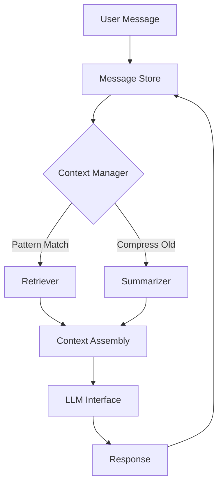
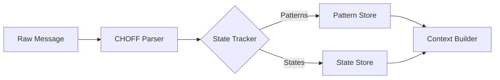
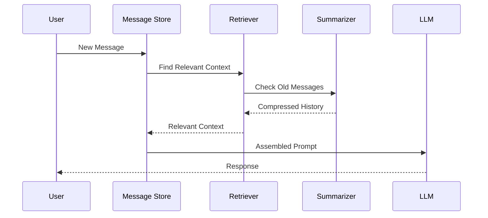
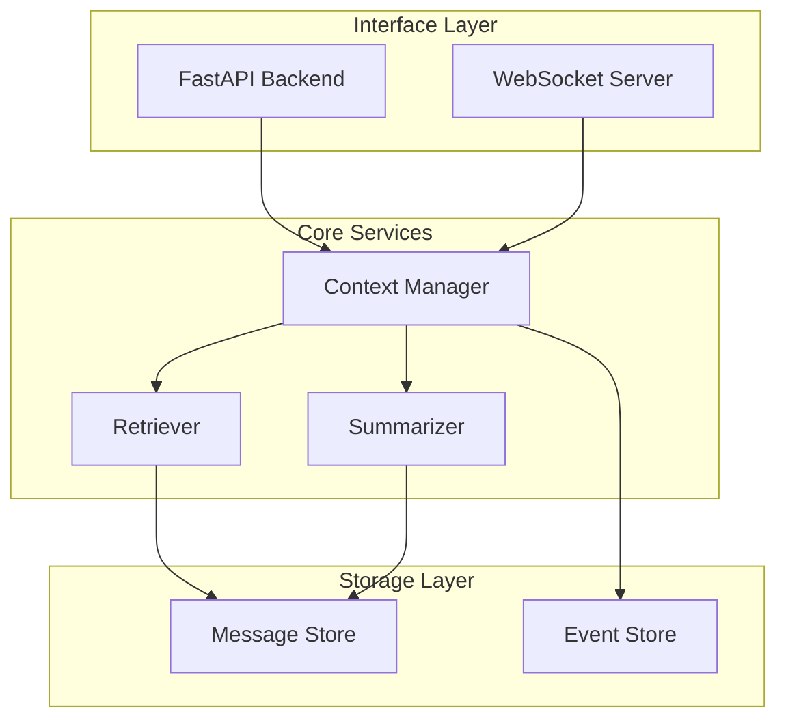

# Hofstadter Infinity Chat (HIC)

*Because your context window deserves better.*

## Overview

HIC is an intelligent chat application that solves the context window limitation of Large Language Models (LLMs) through structured metadata and smart context management. Using CHOFF (Cognitive Hoffman Compression Framework) markers, HIC maintains rich, long-running conversations without losing important context.



## Key Features

- 🧠 **Smart Context Management**
  - CHOFF metadata for structured state tracking
  - Pattern-based relevance scoring
  - Dynamic context assembly



- 🔍 **Intelligent Retrieval**
  - CHOFF-aware message search
  - Pattern evolution tracking
  - State transition validation

- 📝 **Dynamic Summarization**
  - Metadata-preserving compression
  - Pattern-aware condensation
  - State transition tracking



## Architecture

HIC uses a modular, event-driven architecture:



### Components

- **Message Store**: SQLite-based persistence with CHOFF tag support
- **Event Store**: Tracks conversation events and state transitions
- **Retriever**: CHOFF-aware message search and relevance scoring
- **Summarizer**: Intelligent message condensation preserving metadata
- **Context Manager**: Dynamic context assembly and state tracking

## Development

HIC leverages modern Python tooling:
- Python 3.13+
- FastAPI for the web layer
- Trio for async operations
- SQLite for persistence
- Hypothesis for property-based testing

## Getting Started

1. Clone the repository
```bash
git clone https://github.com/yourusername/hic.git
cd hic
```

2. Set up Python environment
```bash
python -m venv .venv
source .venv/bin/activate  # or .venv\Scripts\activate on Windows
pip install -r requirements.txt
```

3. Run the tests
```bash
pytest
```

4. Start the server
```bash
uvicorn hic.api:app --reload
```

## Contributing

Contributions are welcome! Please read our contributing guidelines and code of conduct.

## License

This project is licensed under the MIT License - see the LICENSE file for details.

Built with ❤️ and recursive self-reference

---

*"In the face of context collapse, structure emerges."*